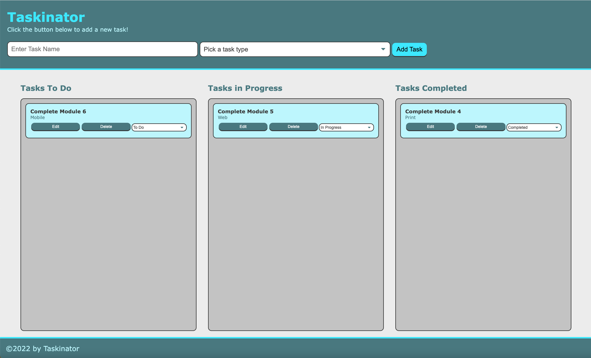

# Taskinator

## Description

This applicaton is an interactive task manager based on the Kanban board methodology.

- The goal of this project is top produce an applicaton that will be able to track and manage project tasks in order to speed development.
- This project will speed development by visually tracking of all significant project tasks and showing instantly the status of each task relative to each other.
- This methodology will make it much less likely that a critical task will be overlooked or allowed to block other tasks.
- Another important goal of this project is to learn the DOM and the associated Web API as it is referenced in JavaScript.  

## Installation

Nothing needs to be installed for this applicaton other than a current version of a web browser such as Chrome, Firefox, or Safari.   All data will be saved locally in the browser.

## Usage

Run the applicatoin from this URL:  https://melliott7264.github.io/taskinator/

Begin adding tasks by entering the task name in the indicated field a the top left of the screen.   Next, select the task type from the drop down menu to the right.  Click on the Add Task button to add the task to the Tasks To Do list.

Once the task is added, you have buttons to Edit or Delete the task and another drop down menu to change the status of the task from To Do to In Progress or Completed.  

    To change the status, simply click on the drop down menu and select the new status.
    To Edit the task name, simply click on the Edit button.  The task name will populate the Task Name field at the top left of the screen allowing you to make changes.  You can also change the task type at that time.   Once satisfied with your changes, click on the Save Task button to make the updates.
    To Delete the task completely,  just click on the Delete button.  

    

## Credits

Mark Elliott  https://github.com/melliott7264

This application was built as part of the Module 4 exercise for the Coding Boot Camp at the University of Richmond starting February 2022: https://courses.bootcampspot.com/courses/1201/pages/4-dot-1-5-build-the-html?module_item_id=460497.   Detailed instructions were provided for all but the localStorage load code and final code optimization.  Starter CSS code was provided.

## License

Copyright (c) 2022 Mark Elliott

Permission is hereby granted, free of charge, to any person obtaining a copy
of this software and associated documentation files (the "Software"), to deal
in the Software without restriction, including without limitation the rights
to use, copy, modify, merge, publish, distribute, sublicense, and/or sell
copies of the Software, and to permit persons to whom the Software is
furnished to do so, subject to the following conditions:

The above copyright notice and this permission notice shall be included in all
copies or substantial portions of the Software.

THE SOFTWARE IS PROVIDED "AS IS", WITHOUT WARRANTY OF ANY KIND, EXPRESS OR
IMPLIED, INCLUDING BUT NOT LIMITED TO THE WARRANTIES OF MERCHANTABILITY,
FITNESS FOR A PARTICULAR PURPOSE AND NONINFRINGEMENT. IN NO EVENT SHALL THE
AUTHORS OR COPYRIGHT HOLDERS BE LIABLE FOR ANY CLAIM, DAMAGES OR OTHER
LIABILITY, WHETHER IN AN ACTION OF CONTRACT, TORT OR OTHERWISE, ARISING FROM,
OUT OF OR IN CONNECTION WITH THE SOFTWARE OR THE USE OR OTHER DEALINGS IN THE
SOFTWARE.

---

